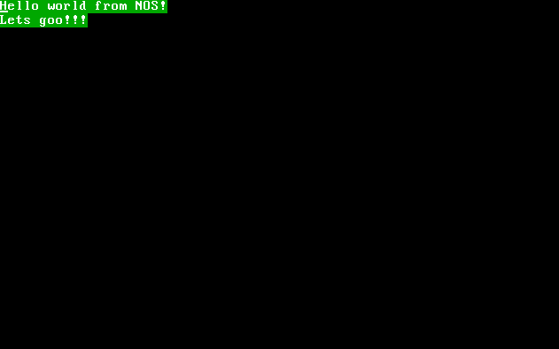

# video.c

### `(void) print (const cstr msg, uint8 format)`

- Prints a string in VGA text mode

- Newlines (\n) are supported

- format is a byte where the first 4 bits are the **background color** and the 4 last bits are the **foreground color**

      So 0x4F (01001111) would be a red background with a bright white foreground

### `(void) println (const cstr msg, uint8 format)`

- Same as normal print but with a newline (\n) at the end

### `(void) setBackgroundColor (uint8 color)`

- Set the background color in VGA text mode

- color is 4 bits

### `(void) setForegroundColor (uint8 color)`

- Set the foreground color in VGA text mode

- color is 4 bits

### `(macro) PRNT_FORMAT (uint8 background, uint8 foreground) -> uint8`

- This macro is a helper function that take 4 bits as background and 4 bits as foreground it then combines them into a byte (8 bits) that can be used to format the colors of a print

      print("Hello world from NOS!\nLets goo!!!\n", PRNT_FORMAT(GREEN, BWHITE));

    

# mem.c

### `(void) memset (uint32* address, int32 data, int32 size)`

- Sets a block of memory to some data 

### `(void) memcpy (uint32* baseAddress, uint32* targetAddress, int32 size)`

- Copies a block of memory from the base address to the target address